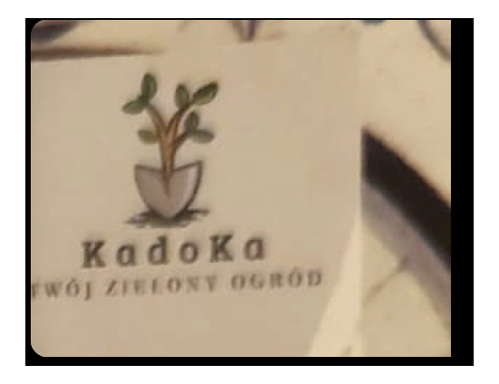

# KADOKA

<p align="center">
  
</p>

Nowoczesna strona firmowa usług ogrodniczych **KADOKA** (Śląsk).

**Strona:** https://franekluczakiewicz-star.github.io/KADOKA/

## Uruchomienie

```bash
npm install
npm run dev
```

## Build

```bash
npm run build
npm run preview
```

## Zawartość

- Hero z logo firmy i pełnoekranowym zdjęciem ogrodu
- Profil firmy
- Zakres usług (PKD 8130Z)
- Realizacje / portfolio
- Opinie klientów (Oferteo 5/5)
- Kontakt i dane rejestrowe

## Stack

React 19 · Vite · Tailwind CSS 3
